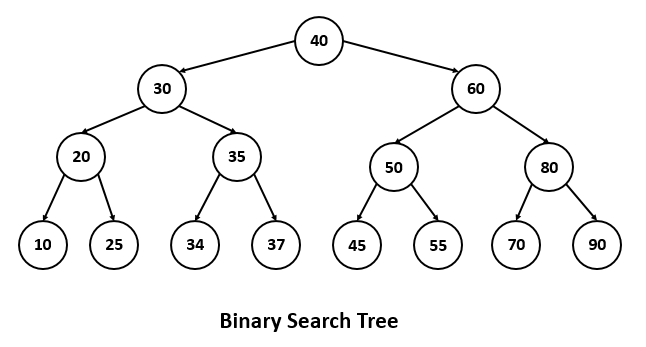
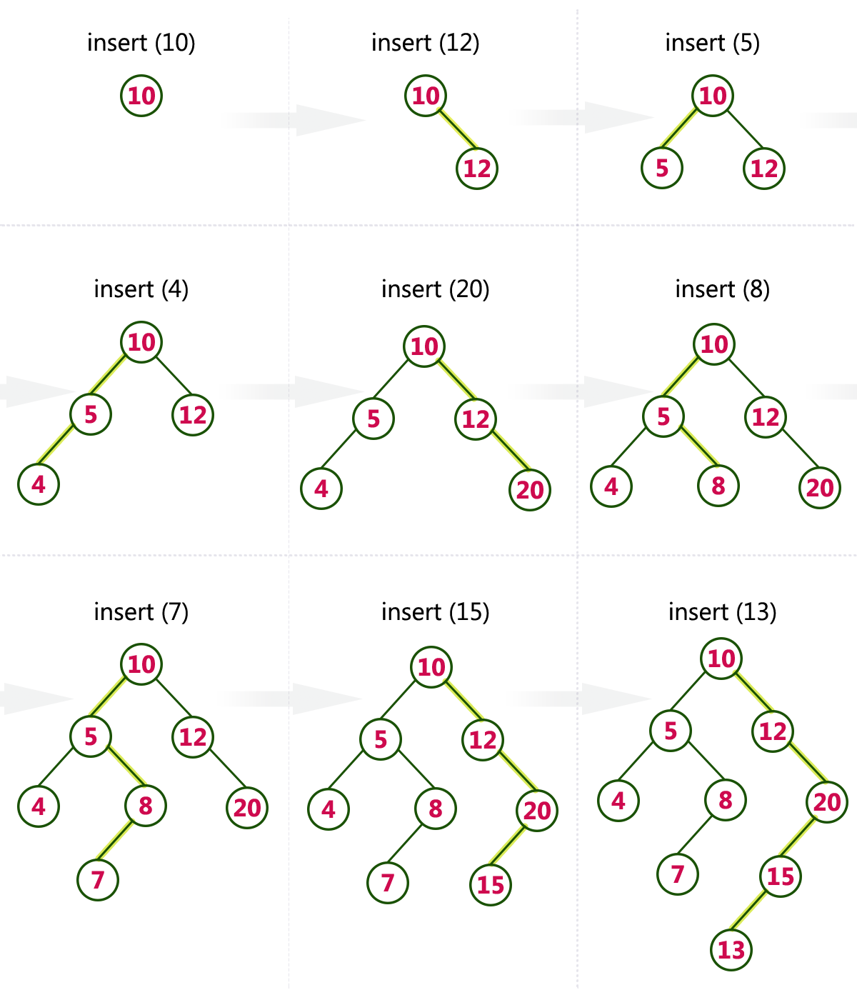

#Contenidos

* Árboles.
* Árbol binario.
* Recorrido in-order, post-order, pre-order.

## Árboles

Está compuesto por 0 o más nodos.

Cada nodo tiene:
  - Dos punteros a los hijos: Uno para el hijo izquierdo, otro para el hijo derecho.
  - Información.

Así como en listas teníamos el nodo Head para acceder a la lista, en árboles tenemos el nodo root(raiz), desde este nodo se construye el árbol.

Un nodo que no tiene hijos se considera como un nodo hoja.

#### Atributos

* Tamaño: Cantidad de nodos que componen el árbol.
* Profundidad: Hay de 2 tipos
  - De nodo: Distancia entre el nodo y la raiz.
  - De árbol: Distancia entre la raiz y el nodo de mayor profundidad.
* Árbol balanceado: Árbol que tiene todos los niveles completos.

## Árbol binario de búsqueda

Árbol en que cada los hijos izquierdo de cada nodo sean menores que el y los hijos derechos sean mayores. Útil para encontrar información.





#### Recorrido de un árbol binario

Se comienza con la raiz del árbol y luego se realizan 3 acciones.

* In-order: Se recorre primero el lado izquierdo del árbol, luego la raiz y finalmente el lado derecho del árbol, o dicho de otra manera, de menor a mayor.
  - Atraviese el sub-árbol izquierdo
  - Visite la raíz
  - Atraviese el sub-árbol derecho
* Pre-order: Se recorre primero la raiz y luego los sub-árboles
  - Visite la raíz
  - Atraviese el sub-árbol izquierdo
  - Atraviese el sub-árbol derecho
* Post-order: Se recorre primero cada sub-árbol y finalmente la raiz
  - Atraviese el sub-árbol izquierdo
  - Atraviese el sub-árbol derecho
  - Visite la raíz

#### Visualización

Pueden comprobar visualmente todas las operaciones y recorrido en el siguiente [link](http://www.cs.armstrong.edu/liang/animation/web/BST.html).

#### Implementación


```python
# -*- coding: utf-8 -*-

class Node:
    def __init__(self, value):
        self.left = None
        self.right = None
        self.value = value
        self.parent = None # Añadimos el atributo parent para facilitar la eliminación de un nodo

class BST:
    def __init__(self):
        self.root = None

    def empty(self):
        return self.root == None

    def _insert(self, value, node):
        if value < node.value:
            if node.left == None:
                node.left = Node(value)
                node.left.parent = node
            else:
                self._insert(value, node.left)
        elif value > node.value:
            if node.right == None:
                node.right = Node(value)
                node.right.parent = node
            else:
                self._insert(value, node.right)
        else:
            print("Value is already in the Tree")

    def insert(self, value):
        if self.empty():
            self.root = Node(value)
        else:
            self._insert(value, self.root)

    def _find(self, value, node):
        if node == None:
            return None
        elif value == node.value:
            return node
        elif value < node.value and node.left != None:
            return self._find(value, node.left)
        elif value > node.value and node.right != none:
            return self._find(value, node.right)

    def find(self, value):
        if self.empty():
            return None
        else:
            return self._find(value, self.root)

    def delete(self, value): #Implementar
        if self.empty():
            return None
        return self.delete_node(self.find(value))

    def delete_node(self, node):
        def min_value_node(n):
            current = n
            while current.left != None:
                current = current.left
            return current
        def number_children(n): # Return the number of childrens of the node to be deleted
            number_children = 0
            if n.left != None:
                number_children += 1
            if n.right != None:
                number_children += 1
            return number_children

        node_parent = node.parent # Get the parent of the node to be deleted
        node_children = number_children(node)

        # Case 1: Deleting a node without childrens
        if node_children == 0:
            if node_parent.left == node:
                node_parent.left = None
            else:
                node_parent.right = None
        # Case 2: Deleting a node with one children
        if node_children == 1:
            # Get the children of the node to be deleted
            if node.left != None:
                child = node.left
            else:
                child = node.right

            # Replace the node to be deleted with its child
            if node_parent.left == node:
                node_parent.left = child
            else:
                node_parent.right = child

            # Change the parent of the child
            child.parent = node_parent
        # Case 3: Deleting a node with two childrens
        if node_children == 2:
            successor = min_value_node(node.right) # Get the inorder successor of the deleted node
            node.value = successor.value # Copy the value
            self.delete_node(successor)

    def in_order(self, node): #Implementar
        if node==None:
            pass
        else:
            self.in_order(node.left)
            print(node.value)
            self.in_order(node.right)

    def post_order(self, node): #Implementar
        if node==None:
            pass
        else:
            self.in_order(node.left)
            self.in_order(node.right)
            print(node.value)

    def pre_order(self, node): #Implementar
        if node==None:
            pass
        else:
            print(node.value)
            self.in_order(node.left)
            self.in_order(node.right)

    def leaf_number(self): #Implementar
        pass


    def _tree_height(self, current, height):
        if current == None:
            return height
        left_height = self._tree_height(current.left, height+1)
        right_height = self._tree_height(current.right, height+1)
        return max(left_height, right_height)

    def tree_height(self): #Implementar
        if self.empty():
            return 0
        else:
            return self._tree_height(self.root, 0)

    def node_height(self, value): #Implementar
        node = self.root
        height = 0
        if self.find(value):
            height += 1
            while node.value != value:
                if value < node.value:
                    node = node.left
                else:
                    node = node.right
                height += 1
            return height
        return False

    def find_minimum(self): #Implementar
        if self.empty():
            return None
        else:
            current = self.root
            while current.left is not None:
                current = current.left
            return current

    def find_maximum(self): #Implementar
        if self.empty():
            return None
        else:
            current = self.root
            while current.right is not None:
                current = current.right
            return current


if __name__=="__main__":
    bst = BST()
    bst.add(10)
    bst.add(12)
    bst.add(5)
    bst.add(4)
    bst.add(20)
    bst.add(8)
    bst.add(7)
    bst.add(15)
    bst.add(13)
```
